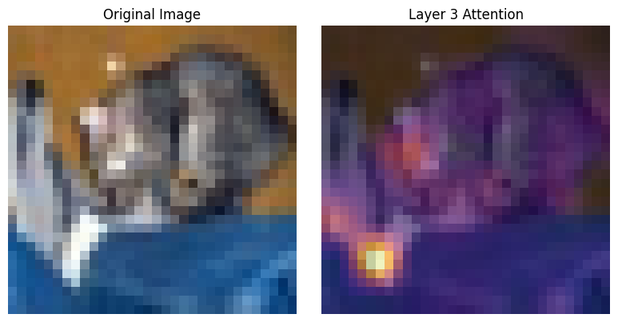
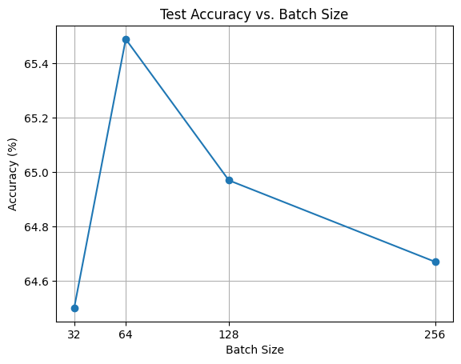

# Vision Transformer (ViT)

In this repo, We will **implement a Vision Transformer (ViT) from scratch** and gain a deep understanding of its core components.

> For more detailed analysis and results, have a look on the notebook!
## Dataset
We will use the **CIFAR-10** dataset, which consists of 60,000 32×32 color images in 10 classes, with 6,000 images per class. The dataset is split into 50,000 training and 10,000 test images.


## 🏗️ Model Architecture
- Attention
- Transformer Block
- ViT Model + positional embedding

## ⚙️ Training Details

- Optimizer: `Adam`
- Loss Function: `CrossEntropyLoss`
- Learning Rate: `3e-4`
- Epochs: `10`

```
Final test Accuracy: 68.07%
```

## Extra effort for improvement
### Sinusoidal positional embedding
```
Test Accuracy: 67.49%
```
<p align="center">
    
</p>

### Differnet batch sizes
<p align="center">
    
</p>